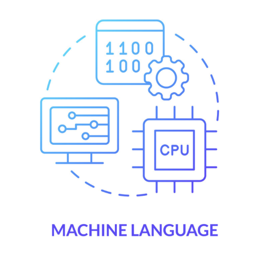
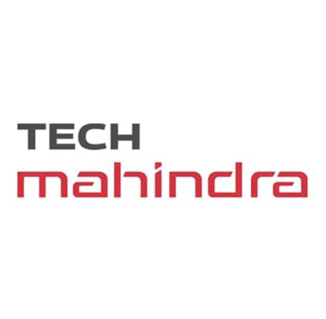
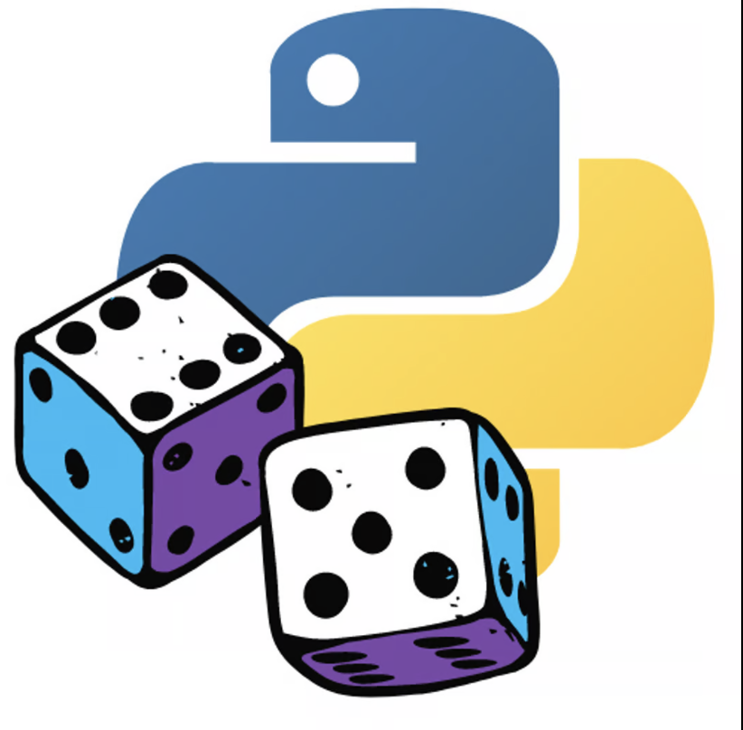
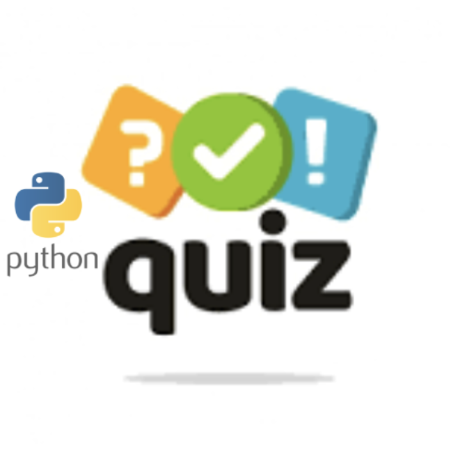

## Data Engineer 

###  Education
Master's in Management Information Systems at the University of Illinois Springfield 

##  Skills
## Programming Languages : 
Python, Java, JavaScript, C, C#, C++, Scala,R, spark,Hadoop

### Cloud Technologies:
AWS, GCP, Azure, Snowflake, Oracle, Docker, Kubernetes

### Big Data and Data Engineering Tools/Services:

Spark, Kafka, Hadoop, Hive, Airflow, HBase, Nifi, Teradata, Amazon RedShift, MapReduce, Flume, Flink, Informatica, Talend, AWS Glue, Amazon S3, Databricks, Azure Data Factory (ADF), Synapse Analytics, Trifacta, JSON, Avro, Parquet, ORC, XML, Protobuf, ELK Stack, PostgreSQL, MongoDB, Google BigQuery, Elasticsearch, HDFS, Metastore

### Machine Learning :
TensorFlow, PyTorch, sci-kit-learn, PySpark

### DevOps, Monitoring, and Other Tools/Services :
Jenkins, JIRA, Confluence, Tableau, Power BI, GitHub, Git, RESTful, Splunk, Prometheus, PowerShell, Linux, UI/UX, Bash, Pub/Sub, Jupyter Notebooks, PyCharm.

##  Work Experience

###  RVO Health, South Carolina                                                                                                                                                                                     September 2022- September 2023
Position: Data Engineer
In my dynamic year of experience, I've mastered the art of designing and maintaining intricate ETL pipelines using Spark (RDDs / Data Frames / Dataset API) with Scala/Python, ensuring precise data processing and analysis to meet diverse business needs. I possess a keen understanding of the big data landscape, adeptly managing large-scale data sets and transforming complex business requirements into scalable technical solutions.

My expertise extends to implementing innovative data solutions on AWS, harnessing the power of services like Kinesis, S3, RedShift, DMS, and Athena for seamless data storage, processing, and analytics. I'm passionate about delving into data intricacies, conducting thorough research, and troubleshooting to ensure data quality and integrity, and collaborating closely with stakeholders to deliver exceptional results.

Managing code repositories on GitHub and orchestrating CI/CD processes for automated testing, deployment, and version control has been a cornerstone of my work. I've leveraged Compute technologies like EMR and Databricks to drive data processing and analytics, while efficiently orchestrating jobs using Airflow and Databricks Workflows.

In a fast-paced environment, my strong analytical prowess, interpersonal finesse, and problem-solving acumen have allowed me to excel, in managing multiple tasks with precision and creativity.

###  Tech Mahindra, Hyderabad , India                                                                                                                 September 2019- August 2022
Position: Data Engineer

During my three years of experience, I have spearheaded the design, development, and maintenance of robust Data Pipelines in Python, utilizing cutting-edge Big Data technologies to enhance data processing efficiency. My expertise extends to optimizing and managing Large Data Lakes and data warehouses, particularly specializing in Snowflake, where I ensure scalability and peak performance for intricate data operations. Proficient in both SQL and NoSQL databases, I have crafted resilient data schemas, fine-tuned queries for optimal performance, and upheld stringent data integrity and security measures.

Additionally, I have seamlessly integrated and processed data using message brokers and AWS services like Kafka/Kinesis, AWS SQS, AWS SNS, Lambda, EMR, Glue, DynamoDB, Aurora, and RDS PostgreSQL. Leveraging CI/CD pipelines through tools such as Jenkins, GoCD, Azure DevOps, and AWS CloudFormation, I have automated software deployment and testing procedures, resulting in streamlined and error-free releases.

My experience extends to deploying and managing software applications on public clouds like AWS and Azure, ensuring their availability, scalability, and reliability. Within Agile frameworks, I have embraced Test-Driven Development (TDD) and Behavior-Driven Development (BDD) methodologies, fostering a culture of high-quality software delivery within strict timelines.
##  Highlighted Projects💡

# [Tokyo-Olympic-Azure-Data-Engineering-Project](https://github.com/Vrachakatla15/Tokyo-olyampics-azure-project-) 

"Dive into the Tokyo-Olympic Azure Data Engineering Project, where I harnessed Azure's mighty arsenal 🌟 to forge a robust data pipeline! Azure Data Factory orchestrated seamless workflows 🛠️, while Data Lake Gen 2 provided the bedrock for scalable data storage 🌊. Synapse Analytics wielded its power for advanced insights and captivating visualizations 📊, and Databricks fueled our data processing and machine learning ambitions 🚀. Real-time data ingestion kept our insights fresh, scalable processing tamed massive datasets 🐘, and Synapse transformed raw data into actionable brilliance 💡. Interactive Power BI dashboards brought our insights to life, making data accessible and impactful . 

# [Data Visualization projects]( https://public.tableau.com/app/profile/vishnupriya.rachakatla/vizzes) 

"I've painted a colorful picture of data throughout my journey, blending analytical prowess 📊 with a keen eye for design 🎨. With skills in data analysis, visualization, and storytelling 📈, I've crafted compelling narratives from complex datasets. Armed with tools like Matplotlib, Tableau, Pandas, and SQL 🛠️, I transform numbers into stories that inspire action 🚀. Dive into the world of data with me and discover the art of meaningful insights!"

# [TicTacToe game with Java](https://github.com/Vrachakatla15/TicTacToe)  

"I crafted a Tic Tac Toe game using Java 🎮, crafting a sleek UI in JavaFX 🖥️ and ensuring robust functionality through JUnit tests 🛠️. I navigated the development process with IntelliJ IDEA 🚀 and maintained version control using GitHub 🌐."

# [DiceGame-using Python](https://github.com/Vrachakatla15/Dicegamewithpython) 

🎲 Dice Game with Python! 🐍
"Embark on an adventure with my Python-built Dice Game 🎲! Experience lifelike dice rolls 🎲, dive into an interactive interface 🖥️, and discover the joy of learning probability and math in a fun and engaging way 🌟
# [QuizGame-using Python](https://github.com/Vrachakatla15/QuizGameWithPython) 
Dive into the world of knowledge with my Python-powered Quiz Game 📚! Test your skills with interactive quizzes 🧠, explore diverse topics, and challenge yourself to learn something new every day 🌟. Experience the thrill of competition and expand your horizons with this engaging game 🚀

# Certifications: 
•	IBM Data Engineer Professional certificate

•	Machine learning specialization by the University of Washington
